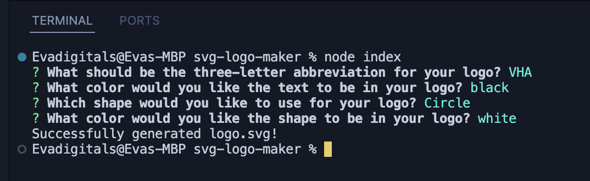
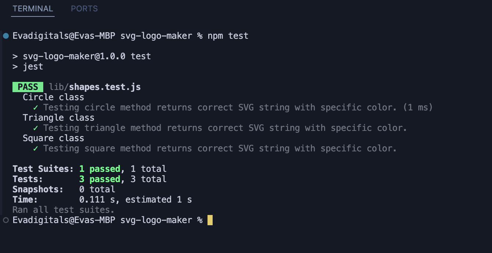

# svg-logo-maker
## Description
* This is a simple script that allows you to create a logo from a svg file.

## Installation
* In the terminal run ```npm i``` code.It will download all the node modules that used in the project.

## Usage
* In the terminal ```npm i``` and than ```node index.js```. 
* After these codes application will start.All you need to do is answering the prompted questions.
* 3 letters for your logo name, pick a color for logo name, choose the listed shapes ```circle, triangle and square``` and pick a color to filled it up shape.
* After these answers your svg file will be created under ```logo.svg``` name.
* 
* 

## Test
* In the terminal run ```npm test``` code.
* 
* All the tests are passed.

## Links
* [Github Repository](https://github.com/veyselarslan12/svg-logo-maker)
* [Video Guide Link](https://drive.google.com/file/d/1o1VGMRudsOClK2YsdeYrxFbpQTGZfIb5/view)
